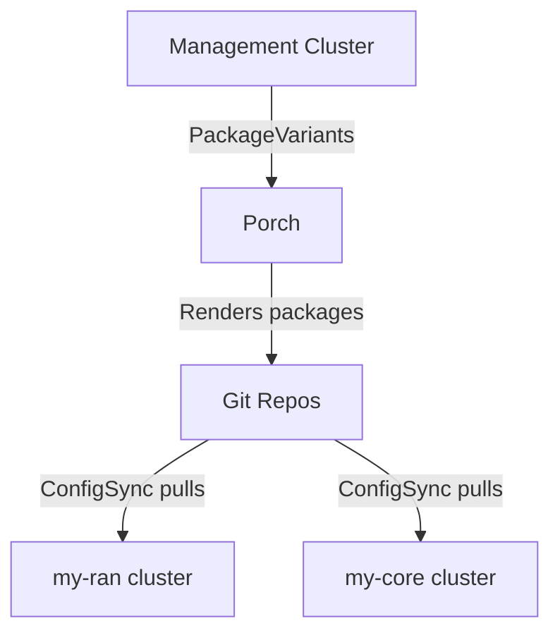

# Platform Addons for Nephio Integration

This guide covers the essential components needed to integrate your existing bare-metal Kubernetes clusters with Nephio.
This document also has some cluster-baseline stuffs.. neglect it.

## Package Overview

```
nephio-integration-packages/
│
└── platform-addons/           # Infrastructure add-ons
    ├── Kptfile
    ├── storage/
    │   └── local-path-provisioner.yaml
    ├── monitoring/
    │   └── metrics-server.yaml
    └── resource-management/
        └── resource-quotas.yaml
```

## What Package Does

### platform-addons

These are **recommended** add-ons for production-like deployments:

1. **Local Path Provisioner** - Dynamic PV provisioning for databases/state
2. **Metrics Server** - CPU/memory metrics for HPA and monitoring
3. **Resource Quotas** - Prevents runaway resource consumption

**Why it's needed:**
- Free5GC needs PVs for MongoDB and other databases
- Network functions may use HPA for scaling
- Resource quotas protect your single-node clusters from over-allocation

## Architecture

### Without Nephio Integration (Current State)

```
┌──────────────┐         ┌──────────────┐
│  my-ran      │         │  my-core     │
│  cluster     │         │  cluster     │
│              │         │              │
│  • Calico    │         │  • Calico    │
│  • kubectl   │         │  • kubectl   │
│    apply     │         │    apply     │
└──────────────┘         └──────────────┘
       ↑                        ↑
       │                        │
       └────────────────────────┘
              Manual Apply
```

### With Nephio Integration

```
┌────────────────────────────────────────┐
│    Nephio Management Cluster           │
│                                        │
│  ┌──────────────────────────────┐     │
│  │ Porch + PackageVariants      │     │
│  └──────────────────────────────┘     │
│                 │                      │
└─────────────────┼──────────────────────┘
                  │
                  │ Writes packages
                  ▼
    ┌─────────────────────────────┐
    │  Git Repositories           │
    │                             │
    │  • nephio-my-ran (repo)     │
    │  • nephio-my-core (repo)    │
    └─────────────────────────────┘
            │              │
            │ ConfigSync   │ ConfigSync
            │ watches      │ watches
            ▼              ▼
    ┌──────────────┐ ┌──────────────┐
    │  my-ran      │ │  my-core     │
    │              │ │              │
    │ • ConfigSync │ │ • ConfigSync │
    │ • Multus     │ │ • Multus     │
    │ • NADs       │ │ • NADs       │
    │ • OAI pods   │ │ • Free5GC    │
    └──────────────┘ └──────────────┘
```

## Component Deep Dive

### ConfigSync

**What it does:**
- Watches a Git repository
- Automatically applies any Kubernetes manifests it finds
- Reconciles drift (if someone `kubectl delete`, ConfigSync recreates)
- Reports sync status back

**Configuration:**
```yaml
apiVersion: configsync.gke.io/v1beta1
kind: RootSync
spec:
  git:
    repo: https://github.com/YOUR-ORG/nephio-my-ran.git
    branch: main
    dir: /                    # Sync entire repo
    auth: none               # or 'token' for private repos
    period: 15s              # Check every 15 seconds
```

**Behavior:**
- On first sync: Applies all manifests in repo
- On changes: Automatically updates cluster
- On deletions: Removes resources from cluster

### Namespace Strategy

Pre-creating namespaces ensures:
- Network functions land in correct places
- Resource quotas apply immediately
- Network policies can reference them
- Labels enable Nephio operators to find them

**Namespace Labels:**
```yaml
metadata:
  labels:
    nephio.org/cluster-name: my-ran
    nephio.org/workload-type: ran
    nephio.org/nf-type: cucp
```

These labels help:
- Nephio operators identify target namespaces
- KRM functions inject correct configurations
- Monitoring tools discover workloads

### Local Path Provisioner

**Why not use hostPath directly?**

| Feature | hostPath | Local Path Provisioner |
|---------|----------|------------------------|
| Dynamic PV creation | ❌ Manual | ✅ Automatic |
| PVC auto-binding | ❌ No | ✅ Yes |
| Multiple PVs | ❌ Manual | ✅ Dynamic |
| Cleanup on delete | ❌ Manual | ✅ Automatic |

**Storage path:** `/opt/local-path-provisioner/`
- Ensure this path exists on your nodes
- Or customize in `local-path-config` ConfigMap

**Testing:**
```bash
cat <<EOF | kubectl apply -f -
apiVersion: v1
kind: PersistentVolumeClaim
metadata:
  name: test-pvc
spec:
  accessModes:
    - ReadWriteOnce
  resources:
    requests:
      storage: 1Gi
  storageClassName: local-path
EOF

kubectl get pvc test-pvc
# Should show STATUS: Bound
```

## Deployment Workflow

### Option A: Full Nephio GitOps (Recommended for Production)



**Steps:**

1. **Setup Git Repos**
```bash
# Create blueprint repo (upstream)
git init nephio-blueprints
cd nephio-blueprints
# Add cluster-baseline/ and platform-addons/ packages
git add . && git commit -m "Initial blueprints"
git push

# Create deployment repos (downstream)
git init nephio-my-ran && cd nephio-my-ran
echo "# Deployment repo for my-ran" > README.md
git add . && git commit -m "Initial" && git push

git init nephio-my-core && cd nephio-my-core
echo "# Deployment repo for my-core" > README.md
git add . && git commit -m "Initial" && git push
```

2. **Register Repos in Nephio**
```bash
kubectl apply -f - <<EOF
apiVersion: config.porch.kpt.dev/v1alpha1
kind: Repository
metadata:
  name: nephio-blueprints
  namespace: default
spec:
  type: git
  content: Package
  deployment: false
  git:
    repo: https://github.com/YOUR-ORG/nephio-blueprints.git
    branch: main
---
apiVersion: config.porch.kpt.dev/v1alpha1
kind: Repository
metadata:
  name: nephio-my-ran
  namespace: default
spec:
  type: git
  content: Package
  deployment: true
  git:
    repo: https://github.com/YOUR-ORG/nephio-my-ran.git
    branch: main
EOF
```

3. **Deploy PackageVariants**
```bash
kubectl apply -f packagevariants-baseline-addons.yaml
```

4. **Monitor Package Rendering**
```bash
# Check PackageVariants
kubectl get packagevariants

# Check rendered packages
kubectl get packagerevisions | grep my-ran

# Approve if in Draft
kubectl patch packagerevision baseline-my-ran-v1 \
  --type=merge -p '{"spec":{"lifecycle":"Published"}}'
```

5. **Verify Git Commits**
```bash
cd nephio-my-ran
git pull
ls -la
# Should see: cluster-baseline/ platform-addons/
```

6. **Install ConfigSync on Workload Clusters**

This is the **critical step** - you must manually install ConfigSync on your existing clusters:

```bash
# On my-ran cluster
kubectl config use-context my-ran

# Create namespace
kubectl create namespace config-management-system

# Apply the cluster-baseline package
# (Get it from your rendered git repo)
cd nephio-my-ran/cluster-baseline
kubectl apply -f configsync.yaml

# Apply the RootSync (tells ConfigSync where to pull from)
# IMPORTANT: Edit rootsync.yaml first to set your repo URL
kubectl apply -f rootsync.yaml

# Repeat for my-core cluster
kubectl config use-context my-core
cd nephio-my-core/cluster-baseline
kubectl apply -f configsync.yaml
kubectl apply -f rootsync.yaml
```

7. **Verify ConfigSync is Syncing**
```bash
kubectl get rootsync -n config-management-system
# Should show: SOURCECOMMIT, SYNCCOMMIT

kubectl get pods -n config-management-system
# Should see: reconciler-manager, root-reconciler
```

### Option B: Manual Apply (Simpler, Good for Testing)

```bash
# On my-ran cluster
kubectl config use-context my-ran

# Apply baseline
kubectl apply -f cluster-baseline/configsync.yaml
kubectl apply -f cluster-baseline/rootsync.yaml
kubectl apply -f cluster-baseline/namespaces.yaml

# Apply addons
kubectl apply -f platform-addons/storage/local-path-provisioner.yaml
kubectl apply -f platform-addons/monitoring/metrics-server.yaml
kubectl apply -f platform-addons/resource-management/resource-quotas.yaml

# Repeat for my-core
```

## Verification Steps

### 1. Check ConfigSync Status

```bash
kubectl get rootsync -n config-management-system

# Expected output:
# NAME        RENDERINGCOMMIT    SOURCECOMMIT       SYNCCOMMIT
# root-sync   abc123...          abc123...          abc123...

# No errors in RENDERINGERRORCOUNT or SYNCERRORCOUNT
```

### 2. Check ConfigSync Pods

```bash
kubectl get pods -n config-management-system

# Expected:
# NAME                                  READY   STATUS
# config-management-operator-xxx        1/1     Running
# reconciler-manager-xxx                2/2     Running
# root-reconciler-xxx                   4/4     Running
```

### 3. Check Storage

```bash
# Check StorageClass
kubectl get storageclass
# Should show 'local-path' as default

# Test PVC
kubectl apply -f - <<EOF
apiVersion: v1
kind: PersistentVolumeClaim
metadata:
  name: test-pvc
  namespace: default
spec:
  accessModes: [ReadWriteOnce]
  resources:
    requests:
      storage: 100Mi
  storageClassName: local-path
EOF

kubectl get pvc test-pvc
# STATUS should be: Bound

kubectl delete pvc test-pvc
```

### 4. Check Metrics Server

```bash
# Check pods
kubectl get pods -n kube-system -l k8s-app=metrics-server

# Test metrics
kubectl top nodes
kubectl top pods -n kube-system

# Should show CPU/memory usage
```

### 5. Check Namespaces

```bash
kubectl get namespaces

# For my-ran, should see:
# - openairinterface
# - oai-ran-cucp
# - oai-ran-cuup
# - oai-ran-du

# For my-core, should see:
# - free5gc
# - free5gc-cp
# - free5gc-up

# Check labels
kubectl get ns openairinterface -o yaml | grep labels -A 5
```

### 6. Check Resource Quotas

```bash
kubectl get resourcequota -n openairinterface
kubectl describe resourcequota ran-quota -n openairinterface

# Should show limits for CPU, memory, PVCs
```

## Troubleshooting

### Issue: ConfigSync not syncing

**Symptoms:**
```bash
kubectl get rootsync -n config-management-system
# Shows RENDERINGERRORCOUNT or SYNCERRORCOUNT > 0
```

**Debug:**
```bash
# Check RootSync status
kubectl describe rootsync root-sync -n config-management-system

# Check reconciler logs
kubectl logs -n config-management-system \
  deployment/reconciler-manager

kubectl logs -n config-management-system \
  -l app=root-reconciler

# Common issues:
# 1. Wrong git repo URL
# 2. Authentication failure (needs git-creds secret)
# 3. Invalid manifests in repo
```

**Fix:**
```bash
# Update RootSync
kubectl edit rootsync root-sync -n config-management-system

# If auth needed, create secret:
kubectl create secret generic git-creds \
  -n config-management-system \
  --from-literal=username=YOUR_USER \
  --from-literal=token=YOUR_TOKEN
```

### Issue: Local Path Provisioner PVCs stuck in Pending

**Symptoms:**
```bash
kubectl get pvc
# STATUS: Pending
```

**Debug:**
```bash
# Check provisioner logs
kubectl logs -n local-path-storage \
  deployment/local-path-provisioner

# Check events
kubectl describe pvc <pvc-name>

# Common issues:
# 1. Path /opt/local-path-provisioner doesn't exist
# 2. Permissions issue on path
# 3. Node selector mismatch
```

**Fix:**
```bash
# Create path on nodes
sudo mkdir -p /opt/local-path-provisioner
sudo chmod 777 /opt/local-path-provisioner

# Or customize ConfigMap
kubectl edit configmap local-path-config -n local-path-storage
# Change "paths":["/opt/local-path-provisioner"] to your path
```

### Issue: Metrics Server not working

**Symptoms:**
```bash
kubectl top nodes
# Error: Metrics API not available
```

**Debug:**
```bash
# Check metrics-server pods
kubectl get pods -n kube-system -l k8s-app=metrics-server

# Check logs
kubectl logs -n kube-system \
  deployment/metrics-server

# Common issues:
# 1. TLS certificate verification failing
# 2. Kubelet not accessible
```

**Fix:**
Already included in our manifests:
```yaml
args:
  - --kubelet-insecure-tls  # For self-signed certs
  - --kubelet-preferred-address-types=InternalIP
```

If still failing:
```bash
# Check if kubelet is running
systemctl status kubelet

# Check kubelet serving certs
curl -k https://localhost:10250/metrics
```

### Issue: Namespace creation conflicts

**Symptoms:**
```
Error: namespace "openairinterface" already exists
```

**This is OK!** ConfigSync will adopt existing resources.

**If you need to clean up:**
```bash
# Delete all resources in namespace
kubectl delete all --all -n openairinterface

# Delete namespace
kubectl delete namespace openairinterface

# ConfigSync will recreate from git
```

## Customization

### Change Storage Path

Edit `platform-addons/storage/local-path-provisioner.yaml`:

```yaml
data:
  config.json: |-
    {
      "nodePathMap":[
        {
          "node":"DEFAULT_PATH_FOR_NON_LISTED_NODES",
          "paths":["/mnt/storage/local-path"]  # Your path
        }
      ]
    }
```

### Add Node-Specific Storage Paths

```yaml
data:
  config.json: |-
    {
      "nodePathMap":[
        {
          "node":"my-ran-node",
          "paths":["/ssd/local-path"]
        },
        {
          "node":"my-core-node",
          "paths":["/hdd/local-path"]
        }
      ]
    }
```

### Adjust Resource Quotas

Edit `platform-addons/resource-management/resource-quotas.yaml`:

```yaml
spec:
  hard:
    requests.cpu: "30"      # Increase for powerful nodes
    requests.memory: 64Gi
    limits.cpu: "40"
    limits.memory: 96Gi
```

### Use Different Storage Class

If you have Rook, Longhorn, or cloud provider storage:

```yaml
# In Kptfile
pipeline:
  mutators:
    - image: gcr.io/kpt-fn/apply-setters:v0.2
      configMap:
        local-path-provisioner: "false"  # Disable
        storage-class-name: rook-ceph    # Use existing
```

### Enable Prometheus (Optional)

Add to `platform-addons/monitoring/prometheus.yaml` (not included, but structure shown):

```yaml
apiVersion: v1
kind: Namespace
metadata:
  name: monitoring
---
# Add Prometheus Helm chart manifests or operator
```

## Integration with Networking Packages

These packages should be deployed **after** the networking packages:

```bash
# Deployment order:
1. cluster-baseline (ConfigSync + namespaces)
2. Networking packages (multus, whereabouts, NADs)
3. platform-addons (storage, monitoring)
4. Workload packages (OAI, Free5GC)
```

**Why this order?**
- ConfigSync must exist before other packages are rendered
- NADs must exist before workload pods reference them
- Storage/monitoring before workloads that need PVs/metrics

## Next Steps

After deploying cluster-baseline and platform-addons:

1. **Verify all components healthy**
2. **Deploy networking packages** (Multus, Whereabouts, NADs)
3. **Test with simple pod** that uses NADs and PVCs
4. **Deploy OAI RAN** and **Free5GC Core** packages
5. **Monitor with `kubectl top` and check logs**

## Summary

| Package | What It Does | Required? |
|---------|--------------|-----------|
| cluster-baseline | ConfigSync + namespaces | ✅ Yes |
| platform-addons/storage | Dynamic PV provisioning | ⚠️ If DBs needed |
| platform-addons/monitoring | Metrics for kubectl top | 🔧 Recommended |
| platform-addons/resource-mgmt | Quota protection | 🔧 Recommended |

**Minimum for Nephio:** cluster-baseline only
**Recommended for 5G:** cluster-baseline + all addons

The baseline packages integrate your clusters into Nephio's GitOps workflow, while addons provide the infrastructure services that network functions typically need.